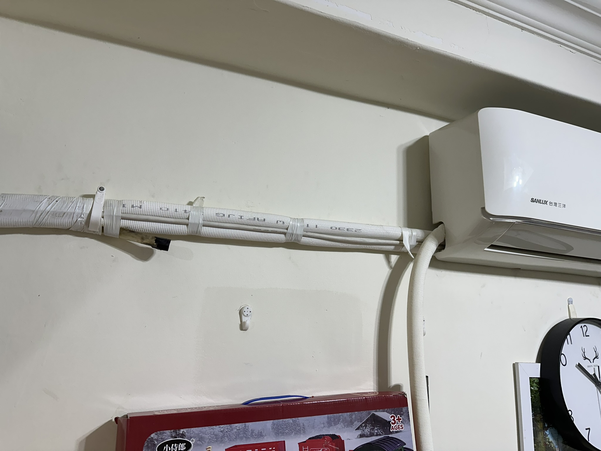
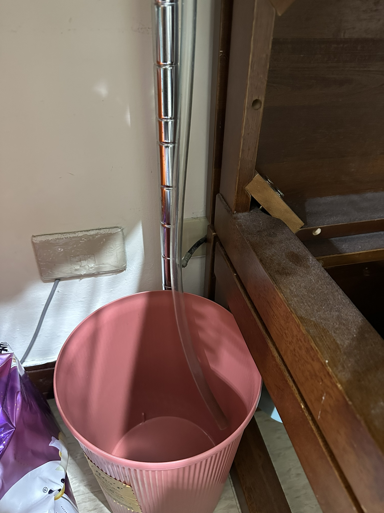
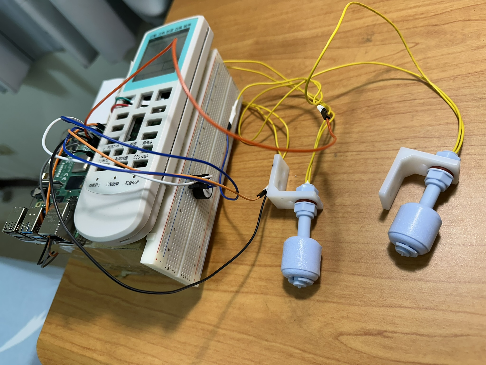
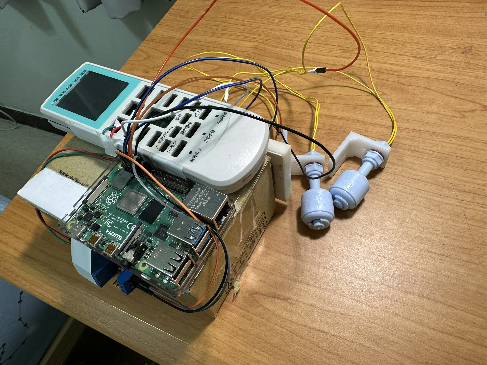
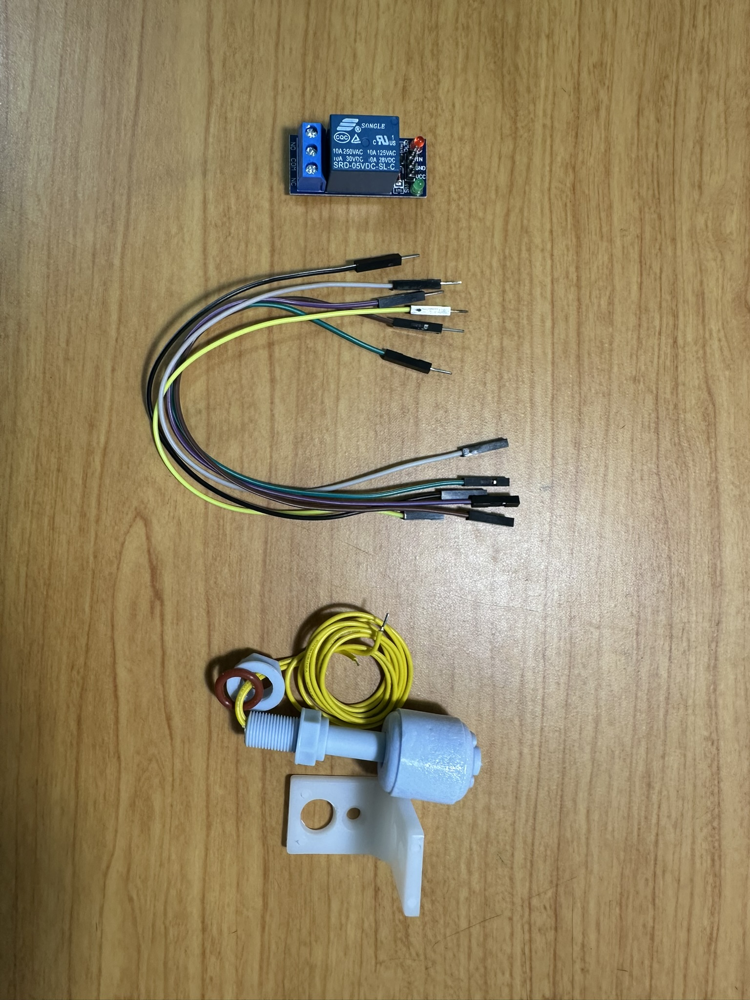
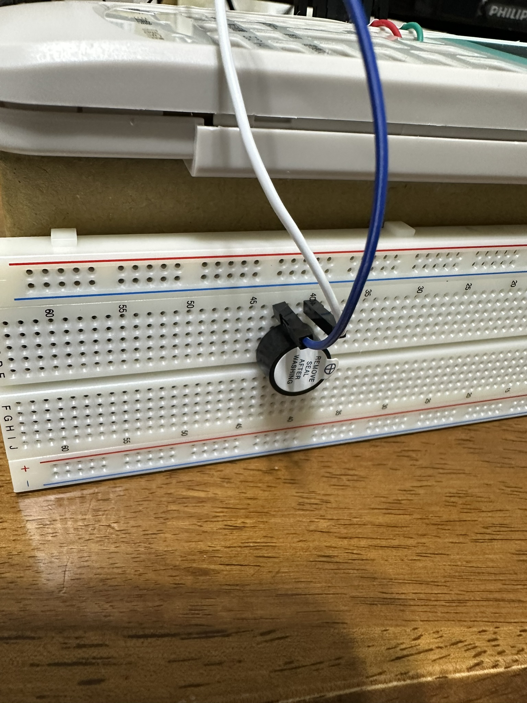
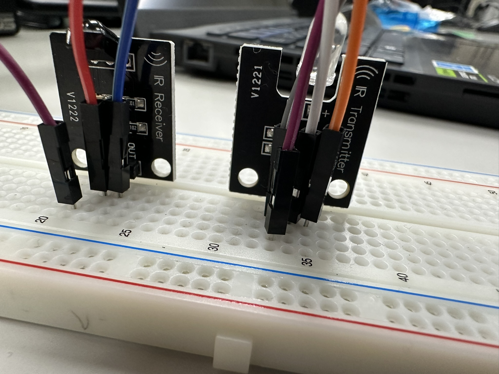
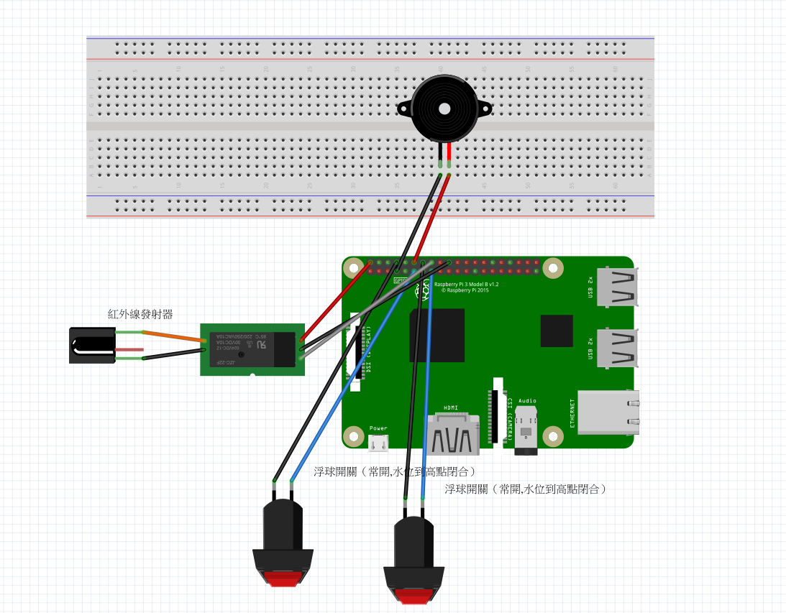

# IoT 水位偵測自動關閉冷氣
作者：113453015 黃景偉

---

## 專案背景
因某些實體環境限制，導致原本外接排水管斜度不足，因而排水異常，造成冷氣室內機漏水，在冷氣師傅建議下，改回傳統方式以水桶接冷氣排水。

改以水桶接水方式後，雖解決了室內機漏水之問題，但卻也延伸出另一個問題，常常水桶滿了而不知情，發現時已是滿地積水，造成生活上困擾，故想透過此專案進行問題改善。
<p align="center">
   
</p>

<p align="center">
    
</p>

## 專案介紹
透過樹梅派設計一個水位偵測警報與回應機制，當偵測到水位來到一定高度時（例如：八分滿），透過蜂鳴器來警示該倒水了；如果沒有任何回應，水位持續上升到最後警戒值（例如：九分滿），則觸發安全機制，自動關閉冷氣機。

---

## 裝置照片


<p align="center">
  
</p>

<p align="center">
  
</p>

---

## 專案硬體所需材料
1. Rasberry Pi 4  
2. 水位偵測器（乾接點）  
3. 5V 繼電器  
4. 蜂鳴器  
5. 麵包版  
6. 杜邦線  
7. 紅外線發射器（以遙控器取代）

<p align="center">
  
</p>
<p align="center">
  
</p>
<p align="center">
  
</p>


---

## 電路配置圖
<p align="center">
  
</p>

---

## 程式碼功能介紹

### 1) 針對水位偵測器進行初始值設定
```python
# 第1顆水位偵測：用內建拉高電阻
GPIO.setup(WATER_PIN, GPIO.IN, pull_up_down=GPIO.PUD_UP)

# 第2顆水位偵測：同樣用內建拉高電阻
GPIO.setup(WATER2_PIN, GPIO.IN, pull_up_down=GPIO.PUD_UP)
```
### 2) 針對警報蜂鳴器與繼電器（用以控制冷氣遙控器）進行初始值設定
```python
# 蜂鳴器：輸出腳
GPIO.setup(BUZZER_PIN, GPIO.OUT)
GPIO.output(BUZZER_PIN, GPIO.LOW)  # 先關閉蜂鳴器

# 繼電器：輸出腳（假設低電位觸發）
'''GPIO.setup(RELAY_PIN, GPIO.OUT)'''
GPIO.setup(23, GPIO.OUT, initial=GPIO.HIGH)
GPIO.output(RELAY_PIN, GPIO.HIGH)  # 先預設為「不吸合、不通電」
```
### 3) 第一段告警（蜂鳴器）
```python
v1 = read_level()
if v1 == 1:
    print("第1顆水位：水高")
    GPIO.output(BUZZER_PIN, GPIO.HIGH)   # 蜂鳴器叫
else:
    print("第1顆水位：水低")
    GPIO.output(BUZZER_PIN, GPIO.LOW)    # 蜂鳴器關
```

### 4) 第二段告警（繼電器觸發關冷氣）

```python
v2 = read_level2()
if v2 == 1:
    print("第2顆水位：水高 -> 繼電器通電（吸合）")
    GPIO.output(RELAY_PIN, GPIO.HIGH)  # 低電位觸發，讓繼電器吸合以關閉冷氣
else:
    print("第2顆水位：水低 -> 繼電器斷電（釋放）")
    GPIO.output(RELAY_PIN, GPIO.LOW)   # 關閉繼電器
```


---

## Demo 影片
- https://youtube.com/shorts/eSp5bl-uCWU

---

## 可以改進的地方
- 整合多顆水位感測器，使用多段水位偵測器或是數位式水位偵測器  
- 增加「不可能狀態判斷」：例如第二顆觸發前第一顆一定先觸發；若順序反了就記錄為異常  
- 增加其他告警機制（例如：LINE 或 Email 通知）

---

## 參考資料
- https://www.reddit.com/r/RASPBERRY_PI_PROJECTS/comments/1dhzwvw/water_level_detection_raspberry_pi/?tl=zh-hant  
- https://www.reddit.com/r/de_EDV/comments/panhes/empfehlung_gesucht_wasserstand_messen_mit/?tl=zh-hant  
- https://www.youtube.com/watch?app=desktop&v=hDFx26F5vZ8


